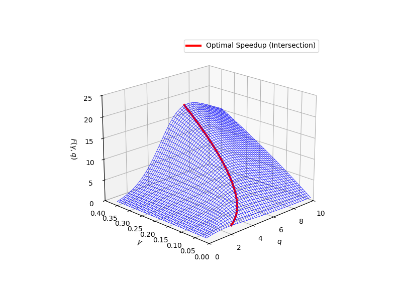

# Lab 01: CCR Speedup Function

## Overview
This lab implements and visualizes the speedup function in parallel computing, which helps understand the relationship between computation and communication in parallel systems.

## Implementation Details
- Language: Python
- Key Libraries: NumPy, Matplotlib
- Main Components:
  - 3D surface plot of speedup function
  - Optimal speedup curve highlighting
  - Parameter k fixed at 10
  - Variable compute-to-communication ratio (γ)

## Speedup Function
The implemented function is:
```
S_γ(2^q, 2^k) = (γ(2^k - 1)) / (2q + γ(2^(k-q) - 1 + q))
```
where:
- γ: compute-to-communication ratio
- q: number of processors (2^q)
- k: problem size parameter (fixed at 10)

## Results
  
The implementation generates a 3D surface plot (`speedup_plot.png`) showing:
- X-axis: Number of processors (2^q)
- Y-axis: Compute-to-communication ratio (γ)
- Z-axis: Speedup value
- Red curve: Optimal speedup for each γ value

## How to Run
1. Ensure Python 3.x is installed
2. Install required packages:
   ```bash
   pip install numpy matplotlib
   ```
3. Run the code:
   ```bash
   python code.py
   ```

## Analysis
The plot helps visualize:
- How speedup varies with the number of processors
- The impact of compute-to-communication ratio on performance
- The optimal number of processors for different γ values
- The diminishing returns of adding more processors 
